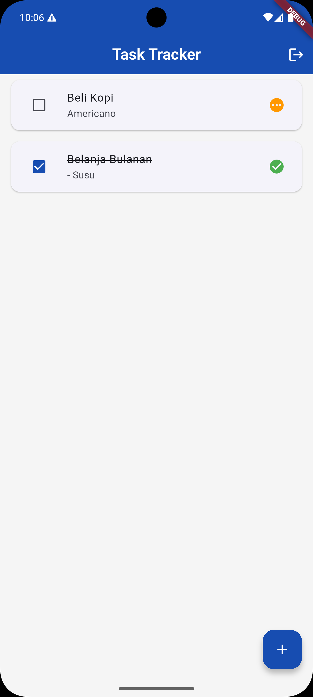
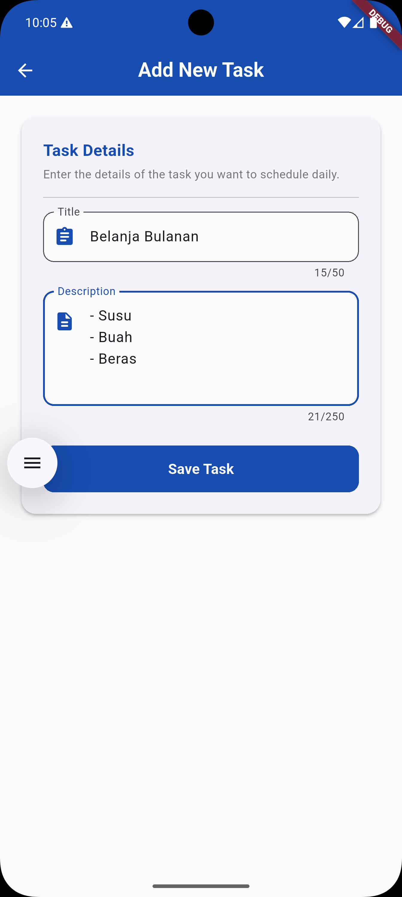
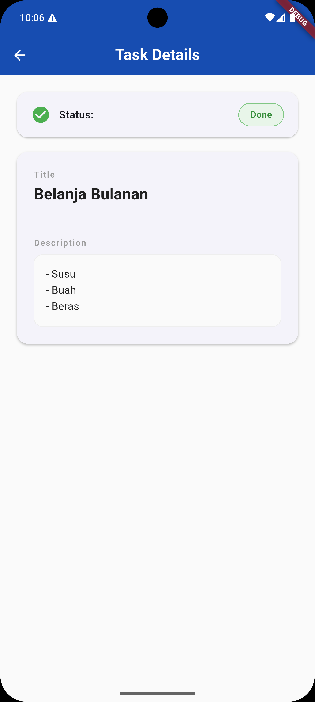

# Task Tracker App

Aplikasi Flutter untuk mengelola task pribadi, dibangun sebagai bagian dari technical test Fullstack Developer.

---

## Demo

### APK
> 📱 [Download APK](https://drive.google.com/file/d/1tFRRe0jZ44ROcvvVT7f_kVGw0g2RNgH3/view?usp=sharing)

### Screenshot
| Task List | Add Task | Task Detail |
|-----------|----------|-------------|
|  |  |  |

---

## Fitur

- Login & Register akun
- Melihat daftar task milik user
- Menambah task baru dengan validasi form
- Melihat detail task
- Mengubah status task (Pending / Done)
- Loading state dengan shimmer effect
- Empty state saat belum ada task
- Error handling untuk semua kondisi jaringan

---

## Cara Menjalankan Project

### Prasyarat

- [Flutter SDK](https://docs.flutter.dev/get-started/install) versi 3.x ke atas
- Android Studio / VS Code
- Emulator Android atau perangkat fisik

### Langkah-langkah

**1. Clone repository**
```bash
git clone https://github.com/username/task-manager-app.git
cd task-manager-app
```

**2. Install dependencies**
```bash
flutter pub get
```

**3. Jalankan aplikasi**
```bash
flutter run
```

### Backend

Aplikasi sudah terhubung ke backend yang telah di-deploy. Tidak perlu setup backend secara lokal.

- **Base URL:** `https://task-manager-go-9xct.onrender.com`
- **Backend Repository:** [task-manager-go](https://github.com/username/task-manager-go)
- **Backend Stack:** Go + PostgreSQL (Supabase) + Docker, deployed di Render

> ⚠️ Catatan: Server menggunakan free tier Render, mungkin perlu ~30 detik untuk "wake up" saat pertama kali diakses setelah lama tidak aktif.

---

## Arsitektur

Project ini menggunakan pendekatan **Clean Architecture** yang dibagi menjadi tiga lapisan utama:

```
lib/
├── core/                          # Utilitas & konfigurasi global
│   ├── errors/                    # Definisi exception & failure
│   ├── helpers/                   # Fungsi bantu
│   └── network/                   # Konfigurasi Dio, interceptor, local storage
│
├── data/                          # Lapisan Data
│   ├── datasources/               # Komunikasi langsung ke API
│   ├── models/                    # Model JSON (TaskModel)
│   └── repositories/              # Implementasi repository
│
├── domain/                        # Lapisan Domain (inti bisnis)
│   ├── entities/                  # Objek murni (Task)
│   ├── repositories/              # Kontrak/interface repository
│   └── usecases/                  # Satu use case = satu aksi bisnis
│
└── presentation/                  # Lapisan UI
    ├── bloc/                      # State management (BLoC)
    ├── pages/                     # Halaman aplikasi
    └── widgets/                   # Widget reusable
```

### Penjelasan tiap lapisan

**`domain/`** — Lapisan paling inti, tidak bergantung pada apapun. Di sini ada:
- **Entity** (`Task`) — representasi data murni tanpa logika serialisasi JSON
- **Repository interface** — mendefinisikan "kontrak" apa yang bisa dilakukan, tanpa peduli caranya
- **Use case** — satu file = satu aksi bisnis (`GetTasks`, `AddTask`, `UpdateTaskStatus`)

**`data/`** — Lapisan yang tahu cara "mengambil data dari dunia luar":
- **Model** (`TaskModel`) — extends entity, ditambah kemampuan `fromJson`/`toJson`
- **DataSource** — yang benar-benar memanggil API menggunakan Dio
- **Repository implementation** — mengimplementasikan kontrak dari domain, menangkap error dari datasource dan mengubahnya menjadi `Failure`

**`presentation/`** — Lapisan UI:
- **BLoC** — menerima event dari UI, memanggil use case, lalu emit state baru
- **Pages** — menampilkan UI berdasarkan state dari BLoC
- **Widgets** — komponen kecil yang reusable (`TaskCard`, `TaskShimmerLoading`, `TaskEmptyState`)

### Alur data (dari UI ke API dan kembali)

```
User tap tombol
      ↓
BLoC menerima Event (misal: FetchTasksEvent)
      ↓
BLoC memanggil Use Case (GetTasks)
      ↓
Use Case memanggil Repository interface
      ↓
Repository Impl memanggil DataSource
      ↓
DataSource memanggil API via Dio
      ↓
Response dikembalikan naik ke BLoC
      ↓
BLoC emit State baru (TaskLoaded / TaskError / TaskEmpty)
      ↓
UI rebuild berdasarkan state terbaru
```

Keuntungan pola ini: setiap lapisan hanya tahu satu hal. Kalau suatu saat ingin ganti API dengan database lokal, cukup ganti `DataSource` tanpa menyentuh Use Case atau UI sama sekali.

---

## State Management — BLoC

Aplikasi menggunakan **flutter_bloc** dengan alasan:

- **Predictable** — setiap perubahan UI didorong oleh state yang eksplisit, mudah di-debug
- **Separation of concerns** — logika bisnis tidak bercampur dengan kode UI
- **Testable** — BLoC bisa ditest tanpa perlu build widget sama sekali
- **Cocok untuk skala tim** — tiap developer bisa kerja di layer berbeda secara paralel

### State yang digunakan di `TaskBloc`

| State | Kapan muncul |
|-------|-------------|
| `TaskInitial` | Saat BLoC pertama kali dibuat |
| `TaskLoading` | Sedang fetch data dari API |
| `TaskLoaded` | Data berhasil dimuat |
| `TaskEmpty` | API berhasil dipanggil tapi data kosong |
| `TaskError` | Terjadi error (jaringan, server, dll) |
| `TaskActionInProgress` | Sedang proses tambah task |
| `TaskActionSuccess` | Task berhasil ditambahkan |

### Kenapa tidak pakai Riverpod atau Provider?

BLoC dipilih karena sifatnya yang **event-driven** cocok untuk use case ini — setiap aksi user (fetch, add, update) dimodelkan sebagai event yang jelas, menghasilkan state yang dapat diprediksi. Untuk project dengan skala lebih kecil, Riverpod atau Provider bisa jadi pilihan yang lebih ringkas.

---

## Keputusan Teknikal

**`dartz` untuk Either**
Digunakan untuk menangani dua kemungkinan hasil fungsi: sukses (`Right`) atau gagal (`Left`). Ini menghindari penggunaan exception yang tersembunyi dan membuat error handling lebih eksplisit dan mudah dibaca.

```dart
// Daripada try-catch di mana-mana:
final result = await getTasks();
result.fold(
  (failure) => emit(TaskError(message: failure.toString())),
  (tasks) => emit(TaskLoaded(tasks: tasks)),
);
```

**`Dio` + `AuthInterceptor`**
JWT token otomatis disertakan di setiap request melalui interceptor, sehingga tidak perlu menyertakan header Authorization secara manual di setiap panggilan API.

**`SharedPreferences` untuk token**
Token JWT disimpan secara lokal agar user tidak perlu login ulang setiap membuka aplikasi.

**Optimistic update pada status task**
Saat user mengubah status task, UI langsung diupdate tanpa menunggu respons API. Jika API gagal, UI dikembalikan ke state semula. Ini membuat aplikasi terasa lebih responsif.

---

## Tech Stack

| Kategori | Library |
|----------|---------|
| State Management | flutter_bloc ^9.1.1 |
| HTTP Client | dio ^5.9.2 |
| Functional Programming | dartz ^0.10.1 |
| Local Storage | shared_preferences ^2.5.5 |
| Loading Effect | shimmer ^3.0.0 |
| Equality Helper | equatable ^2.0.8 |